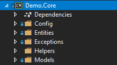
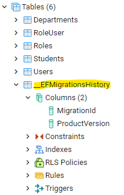

# .Net Core Microservis Mimarisi Kodlama Standartları ve Kod Örnekleri Demo Projesi

Solution, microservis mimarisi örnek yapısı, kod örnekleri ve kodlama standartlarını tarifler.

## Proje Hiyerarşisi   

Bu demo projesinde microservis, 4 katmandan oluşmaktadır. İhtiyaç halinde, bu yaklaşım esnetilebilir, ama çoğu senaryo için 4 soyutlaştırma katmanı ihtiyacı giderecektir.

### Demo.Api

Backend microservis'in sunu katmanı *(Web API projesi)* ve .Net Core Solution'ının bootstraper projesidir.
 
Bootstrapper projesi olduğu için, .NetCore'un IoC Container yapısı bu proje dahilinde bulunacaktır. Bu nedenle, **diğer tüm projelerin referansı bu projeye eklenmelidir.** Başka hiçbir proje bu, projeden referans almayacağı için, aşağıda bulunan proje klasörleri içerisinde detaylandırılacak olan sınıflar, **bu proje** için kullanılacak yardımcı sınıflar olacaktır.

Kullanıcı Arayüzü, bu katmanla entegre olacağı için, kullanıcı arayüz iş kuralları için yazılacak cross cutting concerns, validasyon, mapping gibi işlemler bu katmana adreslenmelidir. 

Bazı açıklamalar;

*Aspect Oriented Programming (AoP), uygulama iş kurallarına dahil olmayan, altyapısal geliştirmelerin, uygulama iş kurallarından soyutlanması. Proje içerisinde bu sorumlulukta olan 2 farklı klasör olacak, middleware ve attributes. Bu klasörlerin farkları aşağıda detaylandırılacak.*

#### Proje dizinleri ve açıklamaları

##### Attributes

Proje içerisinde kullanılan 2 AoP katmanından birisidir. Bu klasör içerisinde .Net'in Attribute sınıfından türeyen sınıflardan oluşacaktır. Attribute'ler Http pipeline'da *(Tüm Requestler için çalışacak akış = middleware)* **kullanılmayacak** olan AoP iş kurallarıdır. Üzerine konduğu EndPoint için, WebAPI katmanındaki kodun önüne*(before)* ve sonuna*(after)* kontrol eklemeyi mümkün kılar. 

Örnekler;

CacheAttribute; 
Before: Üzerine konduğu endpoint'e gelen isteğin yanıtı, CacheProvider içerisinde var ise, Cache'den sonucu alır, ve kullanıcıya yanıt döner. 
WebAPI: Eğer CacheProvider üzerinde veri yok ise, EndPoint katmanına düşer. Endpoint ilgili datayı veritabanından çeker.
After: İstemciye yanıt dönmeden önce, dönülecek yanıtı Cache Provider'a iletir. 

AuthorizeAttribute;
Bir EndPoint'i belirli bir rol tarafından erişilebilir yapmak için, gelen http isteğindeki Token'ın içerisinde rol listesinde, Attribute üzerinde belirlenen rolün olup olmadığını kontrol eder.

##### Controllers

WebAPI Projesinin, EndPoint sınıflarının yerleştirildiği dizindir. Burada Controller olarak sınıfları ayrıştırmak isteklerin path'lerini değiştirecektir. Pipeline üzerinde geliştirilecek özel kod blokları sayesinde, farklı Controller class'larının farklı akışlardan geçmesi sağlanabilir. 

Bunun dışında da mantıksal olarak bu sınıfları ayırmak önerilir. Kullanıcı işlemleri için UserController, Dokümantasyon işlemlerini ayırmak için, DocumentController gibi ayrımlar okunurluğu ve idame edilebilirliği kolaylaştıracaktır. 

##### Dtos

Arayüz nesneleri ile, veritabanı nesneleri çoğu zaman aynı olmayacak, ya da gelen bazı istek nesnelerinin veritabanında bir karşılığı olmayacaktır. Login isteğindeki, kullanıcı adı ve parolası gibi (veritabanında User tablosunda tutulduğunu düşünün). Bu gibi durumları standartlaştırmak için, ve birden fazla arayüz istemcisine en az miktarda kod yazdırmak için, Backend katmanı, çalıştırdığı iş kurallarından sonra, elindeki nesneyi, arayüzün beklediği nesne tipine çevirir. 

Bu arayüzün istediği nesne yapısındaki nesnelerimize, eğer bu sunucuya gelen bir istek ise, RequestDto, bu sunucudan yanıt dönen bir nesne ise, ResponseDto soneki ile adlandırıyoruz *(AuthenticationRequestDto veya AuthenticationResponeDto gibi)*.

Dto nesneleri sadece serileştirme ve deserileştirme işlemlerinde kullanılacakları için, Constructor ve Propertyler bulundurmalıdırlar, method olmamalıdır.  

##### Filters

???

##### Helpers

Sunum katmanının ihtiyacı olacak, yardım sınıflarının bulunduğu dizindir. 

Örneğin, indirilecek dosyanın uzantısına göre, mime-type mapping sınıfı, ya da Upload edilen bir Stream'in dosyalaştırılma işlemi gibi.

##### HostedServices

HostedService, .Net Core'un kendi sunduğu HttpPipeline haricinde tetiklenebilen (özellikle time trigger) asenkron işlem altyapısı için kullanılan sınıftır. HostedService sınıfından türettiğimiz sınıfları bu dizinde birleştireceğizdir.

##### Middlewares

Solution içerisinde yer alan diğer AoP katmanıdır. Middleware'ler startup.cs sınıfında HttpPipeline'a inject edilir. İnject edilme sırasına göre, istek henüz Controller katmanına ulaşmamışken kodun önüne*(before)* ve sonuna*(after)* kontrol eklemeyi mümkün kılar. Genel geçer cross-cutting concernler için kullanışlıdır. 

Örneğin;

ExceptionHandling; Uygulamada fırlatılan herhangi bir hatayı, uygulama iş kurallarının dışında yakalamak ve dönecek yanıtı yönetmek için kullanılabilir.
LogMiddleware; Gelen ve giden tüm istekleri loglamak için kullanılabilir.
AuthenticationMiddleware; Gelen isteklerin Header'ındaki Token'ın decrypt edilmesi ve Global değişkenlere atanması için kullanılabilir.

##### appsettings.json

Uygulamada kullanılacak ortam değişkenlerinin ve sık kullanılması öngörülen parametrelerin, *geliştirme sırasında* okunabileceği ayarlar dosyası. Json notasyonuyla ifade edilir. Ancak microservislerimiz, K8s cluster'ına deploy edileceği zaman bu dosya kullanılmayacaktır, detaylı açıklama Containerization başlığı altında tariflenmiştir.

##### Startup.cs

Startup.cs sınıfı Program.cs tarafından oluşturulan, ve WebAPI projesinin Servis Tanımlarının (ConfigureServices()) ve Pipeline'ın(Configure()) konfigüre edildiği sınıftır. Gerekli yorumlar startup.cs içerisinde detaylandırılmıştır. *DETAYLANDIR!!!*

##### Program.cs

Uygulama çalıştırıldığında, işletim sistemi tarafından ilk tetiklenen sınıftır. Uygulama domain'i dışında, altyapı işlemleri için müdehale edilebilir. Eğer veritabanın yoksa veritabanını oluştur, LogProvider olarak Serilog kullanılacak gibi

### Demo.Core

Projenin tüm katmanlarında kullanılacak, sunu, iş kuralı veya veri erişimi haricindeki sınıfların yerleştirileceği projedir. Tüm projeler Core projesinden referans almalıdır. 

#### Proje dizinleri ve açıklamaları

##### Config

İhtiyaca göre, eğer config dosyaları okunacaksa oluşturulabilecek bir dizin. Demo projesinde, appsettings.json kullanımı olduğu için, dosyanın deserileştirildiği bir sınıf ve environment variables yönetmek için konulmuş sınıf örneği var. Appsetting.json ve EnvironmentVariable kullanım amacı farkı için, Containerization bölümünü inceleyebilirsiniz. 

##### Entities

Veritabanı şemasına karşılık gelecek, sınıfların bulunduğu dizindir. 

##### Exceptions

Uygulamada kendi implemente ettiğimiz, CustomException'lar kullanmak istersek, ekleyebileceğimiz dizindir. Bu exception'lar, ExceptionMiddleware katmanında, tanımlı bir HttpStatus code'a map'lenmek için kullanılabilir.

##### Helpers

Uygulama genelinde kullanılacak yardımcı sınıfların yerleştirileceği dizindir.

##### Models

Veritabanı Entity'si olmadığı halde, katmanlar ya da sınıflar arası veri taşıma amacıyla kullanılacak nesneler için oluşturulan dizindir.

### Demo.Data

### Demo.Service

## İsimlendirme Standartları

## Migration

Migration işlemi, CodeFirst yaklaşımıyla geliştirilen projelerde, Entity Schema üzerinde yapılan değişikliklerin, fark scriptlerinin oluşturulması ve hedef veritabanına uygulanmasıdır. 
Akış şu şekilde gerçekleşmektedir. 
Api ve Data katmanlarına, EntityFrameworkCore.Tools nuget paketi indirilmelidir.
Yazılımcı, VisualStudio üzerindeki, PackageManageConsole üzerinden, DefaultProject:Demo.Data seçimi yaparak "Add-Migration init" komutu çalıştırdığında, uygulamanın entity schemasına uygun sql create scriptleri oluşturacaktır.
Data projesinin altında Migration isimli bir klasör ve içerisinde tarih öneki ile yyyymmddHHMMSS-init.cs sınıfının oluştuğu görülecektir.
Program.cs'deki ...context.Migrate() methodu çalıştırıldığında, *(program.cs'de olduğu uygulama çalıştığında çalışmak zorunda)* bu fark scriptleri uygulamanın bağlandığı veritabanına uygulanacaktır.
Veritabanı incelendiğinde, __EFMigrationHistory isimli bir tablonun oluştuğu görülecektir. Bu tablo uygulanan her migration kaydının ismini tutmaktadır. Bu sayede, n migration geriden gelen bir ortama kurulum yapıldığında, eksik 3 migration uygulanacak ve veritabanı şeması uygulamanın entity şeması ile senkronize olacaktır. 
İlerleyen süreçte yazılımcı, EntitySchema üzerinde değişiklik yaptığında, bu değişikliklerin çalıştığı veritabanına yansıması için, tekrar "Add-Migration MIGRATIONNAME" komutu çalıştırmalıdır. 
Uygulama ayağa kalkarken, *(Çalıştığı ortamdan bağımsız)* eksik olan migration scriptlerini çalıştıracak ve veritabanı şemasını, entity şemasıyla aynı yapacaktır. 

## Containerization